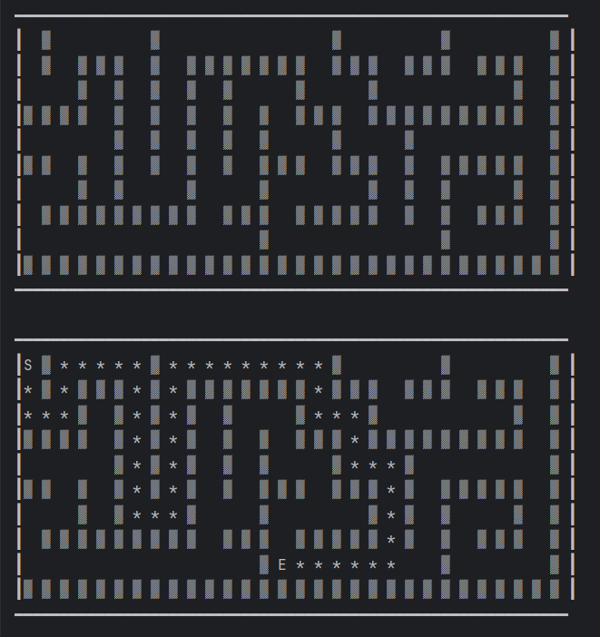

## Алгоритм генерации лабиринта (DFS):

Замечание: предполагается, что изначально у каждой клетки есть стенки со всех четырех сторон, которые отделяют ее от соседних клеток.

1. Пока стек не пустой, продолжаем выполнение.
2. Получаем текущую позицию из верхнего элемента стека.
3. Получаем список непосещенных соседей текущей позиции.
4. Если список соседей не пустой:
   1. Выбираем случайного соседа из списка.
   2. Удаляем стену между текущей позицией и выбранным соседом.
   3. Устанавливаем тип выбранной соседней клетки в тип "PASSAGE" (проходимый проход).
   4. Помещаем выбранную соседнюю клетку в стек.
5. Если список соседей пустой:
   1. Извлекаем текущую позицию из стека, так как мы достигли тупика.
6. Повторяем шаги 2-5 до тех пор, пока стек не станет пустым.

## Алгоритм решения лабиринта (DFS || backtracker)

1. Сделайте начальную клетку текущей и отметьте ее как посещенную.
2. Пока не найден выход
3. Если текущая клетка имеет непосещенных «соседей»
   1. Протолкните текущую клетку в лист
   2. Выберите случайную клетку из соседних
   3. Сделайте выбранную клетку текущей и отметьте ее как посещенную.
4. Иначе если стек не пуст
   1. Выдерните верхнюю клетку из стека
   2. Сделайте ее текущей
5. Иначе выхода нет

## Алгоритм решения лабиринта (BFS)

1. Добавьте начальную клетку в очередь
2. Пока очередь не пуста
3. Выберите первую клетку из очереди(poll())
4. Сделайте выбранную клетку текущей
5. Если текущая клетка имеет непосещенных «соседей»
    1. Помечаем всех соседей текущей клетки посещенными и добавляем их в очередь
6. Иначе выхода нет

## Запуск
Запуск осуществляется из Main.java

## Пример генерации и решения

Лабиринт с высотой 10, шириной 30. Ищется путь из (0, 0) в (8, 14)

