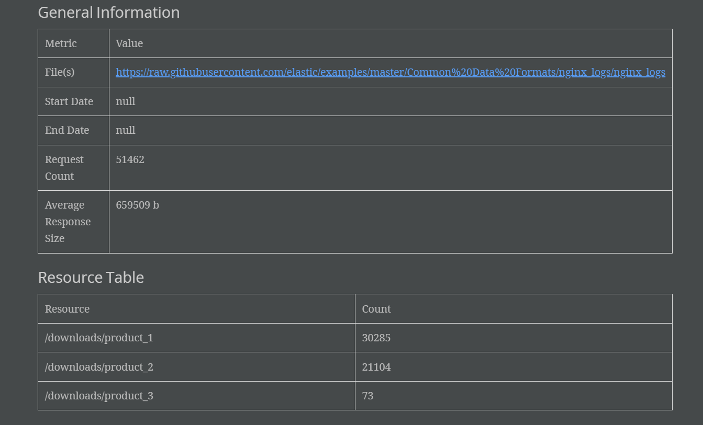
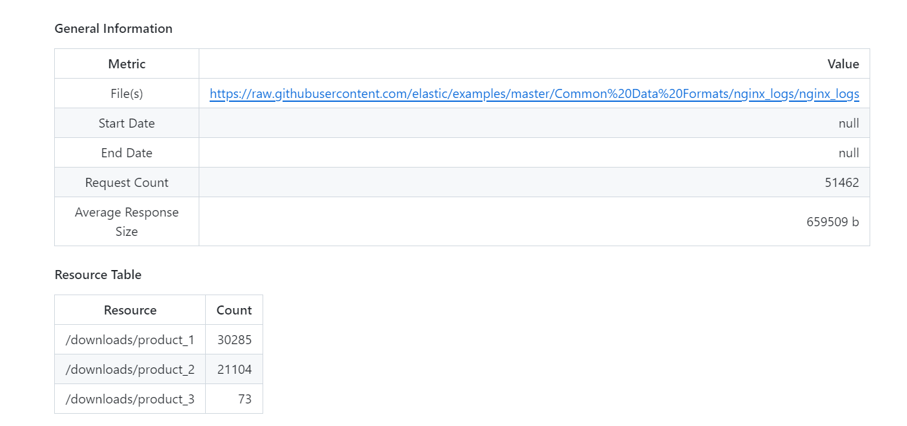

# ПРОЕКТ 3: Анализатор логов
На вход программе через аргументы командной строки задаётся:

1. путь к одному или нескольким NGINX лог-файлам в виде локального шаблона или URL
2. опциональные временные параметры from и to в формате ISO8601
3. необязательный аргумент формата вывода результата: markdown или adoc

### Примеры вызова программы:

java -jar nginx-log-stats.jar --path logs/2023* --from 2023-08-31 --format markdown

java -jar nginx-log-stats.jar --path https://raw.githubusercontent.com/elastic/examples/master/Common%20Data%20Formats/nginx_logs/nginx_logs --format adoc

java -jar nginx-log-stats.jar --path logs/**/2023-08-31.txt

### Программа выполняет следующие задачи:

1. Подсчитывает общее количество запросов
2. Определяет наиболее часто запрашиваемые ресурсы
3. Определяет наиболее часто встречающиеся коды ответа
4. Рассчитывает средний размер ответа сервера

### Дополнительная статистика:
1. Определяет 10 наиболее часто встречающихся IP и подсчитывает их количество
2. Определяет наиболее часто встречающиеся запросы

### Запуск программы
Через Main.java

### Результат выполнения программы

Результат можно посмотреть в файлах
example.adoc:

example.md:

