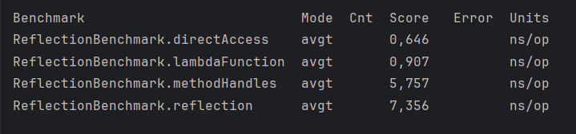

# Проект 5: быстрая рефлексия

Реализованы 4 способа обращения к методу Student#name():

1. Прямой доступ
2. java.lang.reflect.Method
3. java.lang.invoke.MethodHandles
4. java.lang.invoke.LambdaMetafactory

Сравнение производительности:

#### Запуск
Запуск осуществляется из Main.java
